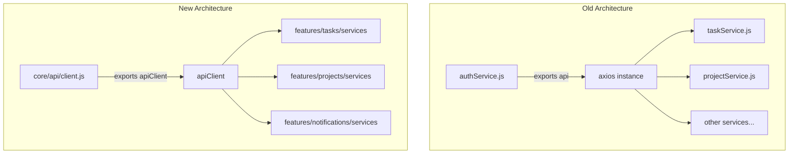

# Frontend Services Migration Analysis

## Executive Summary

This analysis examines the current frontend services structure and provides a migration plan for integrating services into a feature-based architecture. The project currently has **14 services in `services/`** and **4 features with their own services**. There are notable duplications and inconsistencies that need to be addressed.

---

## 1. Service Inventory Table

### Services in `frontend/src/services/`

| Service File | Purpose | Feature-Specific? | Dependencies | Consumers |
|-------------|---------|-------------------|--------------|-----------|
| [`authService.js`](frontend/src/services/authService.js) | Authentication API client with CSRF handling, exports `api` axios instance | **NO** - Global | axios | 15+ files (stores, pages, services) |
| [`calendarService.js`](frontend/src/services/calendarService.js) | Calendar view task operations, date navigation | **YES** - Tasks | authService (api) | TaskCalendar.jsx |
| [`datePreferenceService.js`](frontend/src/services/datePreferenceService.js) | Date formatting preferences synced with backend | **NO** - Shared | preferenceService | useDateFormat.js, DateDisplay.jsx |
| [`dateService.js`](frontend/src/services/dateService.js) | Jalali/Gregorian date conversion utilities | **NO** - Shared | persianNumerals util | 5+ components/hooks |
| [`i18nService.js`](frontend/src/services/i18nService.js) | Internationalization, translations | **NO** - Global | locale JSON files | i18nStore.js |
| [`preferenceService.js`](frontend/src/services/preferenceService.js) | User preferences API operations | **NO** - Shared | authService (api, initCsrf) | preferenceStore.js, Settings.jsx, Profile.jsx |
| [`projectService.js`](frontend/src/services/projectService.js) | Project CRUD API operations | **YES** - Projects | authService (api, initCsrf) | projectStore.js |
| [`socialAuthService.js`](frontend/src/services/socialAuthService.js) | OAuth login (Google, GitHub) | **NO** - Shared (Auth) | authService (api, initCsrf) | Login.jsx, Register.jsx |
| [`subtaskService.js`](frontend/src/services/subtaskService.js) | Subtask API operations | **YES** - Tasks | authService (api, initCsrf) | TaskDetails.jsx |
| [`tagService.js`](frontend/src/services/tagService.js) | Tag CRUD API operations | **YES** - Tasks | authService (api, initCsrf) | TaskForm.jsx |
| [`taskOptionsService.js`](frontend/src/services/taskOptionsService.js) | Task status/priority options | **YES** - Tasks | authService (api) | TaskForm.jsx, TaskList.jsx, CalendarFilters.jsx, TaskModal.jsx |
| [`taskSearchService.js`](frontend/src/services/taskSearchService.js) | Task search API operations | **YES** - Tasks | authService (api, initCsrf) | useTaskSearch.js |
| [`taskService.js`](frontend/src/services/taskService.js) | Task CRUD API operations | **YES** - Tasks | authService (api, initCsrf) | taskStore.js, Dashboard.jsx, TaskModel.js, TaskModal.jsx |
| [`themeApi.js`](frontend/src/services/themeApi.js) | Theme settings API | **NO** - Shared | **BROKEN** (imports non-existent `./api`) | **None** |

### Services Already in Features

| Feature | Service | Uses | Status |
|---------|---------|------|--------|
| [`features/tasks`](frontend/src/features/tasks/services/taskService.js) | taskService.js | core/api/client.js | ✅ New architecture |
| [`features/projects`](frontend/src/features/projects/services/projectService.js) | projectService.js | core/api/client.js | ✅ New architecture |
| [`features/notifications`](frontend/src/features/notifications/services/notificationService.js) | notificationService.js | core/api/client.js | ✅ New architecture |
| [`features/settings`](frontend/src/features/settings/services/settingsService.js) | settingsService.js | core/api/client.js | ✅ New architecture |

---

## 2. Key Findings

### 2.1 Duplicate Services

There are **duplicate services** that need consolidation:

| Old Location | New Location | Issue |
|-------------|--------------|-------|
| `services/taskService.js` | `features/tasks/services/taskService.js` | Both exist with different implementations |
| `services/projectService.js` | `features/projects/services/projectService.js` | Both exist with different implementations |

### 2.2 API Client Inconsistency



**Problem**: Two different API client implementations exist:
- **Old**: `api` from `authService.js` (axios-based)
- **New**: `apiClient` from `core/api/client.js` (fetch-based)

### 2.3 Broken Service

[`themeApi.js`](frontend/src/services/themeApi.js:7) imports from `./api` which does not exist:
```javascript
import api from './api';  // This file doesn't exist!
```

### 2.4 Service Classification

| Category | Services | Recommended Location |
|----------|----------|---------------------|
| **Global/Core** | authService, i18nService | `services/` or `core/` |
| **Shared Utilities** | dateService, datePreferenceService, preferenceService | `shared/services/` or `services/` |
| **Feature-Specific** | taskService, projectService, subtaskService, tagService, taskOptionsService, taskSearchService, calendarService | `features/{feature}/services/` |
| **Auth-Related** | socialAuthService | `services/` or `features/auth/services/` |
| **Broken/Unused** | themeApi | Delete or fix |

---

## 3. Migration Plan

### Phase 1: Fix Critical Issues

1. **Delete or fix [`themeApi.js`](frontend/src/services/themeApi.js)**
   - Currently broken and unused
   - Option A: Delete if truly unused
   - Option B: Fix import and move to appropriate location

### Phase 2: Consolidate Duplicates

2. **Consolidate taskService**
   - Old: [`services/taskService.js`](frontend/src/services/taskService.js) - used by stores/pages
   - New: [`features/tasks/services/taskService.js`](frontend/src/features/tasks/services/taskService.js) - uses new API client
   - **Action**: Update all consumers to use feature service, delete old

3. **Consolidate projectService**
   - Old: [`services/projectService.js`](frontend/src/services/projectService.js) - used by projectStore.js
   - New: [`features/projects/services/projectService.js`](frontend/src/features/projects/services/projectService.js) - uses new API client
   - **Action**: Update all consumers to use feature service, delete old

### Phase 3: Migrate Feature Services

4. **Create `features/tasks/services/` structure**
   - Move: `taskService.js`, `subtaskService.js`, `tagService.js`, `taskOptionsService.js`, `taskSearchService.js`, `calendarService.js`
   - Update all imports

5. **Create `features/auth/services/` structure** (optional)
   - Move: `socialAuthService.js` (authService stays global)

### Phase 4: Organize Shared Services

6. **Keep in `services/`** (global/shared):
   - `authService.js` - Core API client, used everywhere
   - `i18nService.js` - Global i18n
   - `preferenceService.js` - Shared preferences
   - `dateService.js` - Shared utility
   - `datePreferenceService.js` - Shared utility

---

## 4. Import Update Map

### 4.1 taskService Migration

| File | Old Import | New Import |
|------|------------|------------|
| [`stores/taskStore.js`](frontend/src/stores/taskStore.js:26) | `@/services/taskService` | `@/features/tasks/services/taskService` |
| [`pages/Dashboard.jsx`](frontend/src/pages/Dashboard.jsx:7) | `@/services/taskService` | `@/features/tasks/services/taskService` |
| [`models/TaskModel.js`](frontend/src/models/TaskModel.js:9) | `@/services/taskService` | `@/features/tasks/services/taskService` |
| [`components/tasks/TaskModal.jsx`](frontend/src/components/tasks/TaskModal.jsx:23) | `@/services/taskService` | `@/features/tasks/services/taskService` |

### 4.2 projectService Migration

| File | Old Import | New Import |
|------|------------|------------|
| [`stores/projectStore.js`](frontend/src/stores/projectStore.js:22) | `@/services/projectService` | `@/features/projects/services/projectService` |

### 4.3 Services to Move to features/tasks/services/

| Service | Current Path | New Path | Consumers |
|---------|-------------|----------|-----------|
| subtaskService | `@/services/subtaskService` | `@/features/tasks/services/subtaskService` | TaskDetails.jsx |
| tagService | `@/services/tagService` | `@/features/tasks/services/tagService` | TaskForm.jsx |
| taskOptionsService | `@/services/taskOptionsService` | `@/features/tasks/services/taskOptionsService` | TaskForm.jsx, TaskList.jsx, CalendarFilters.jsx, TaskModal.jsx |
| taskSearchService | `@/services/taskSearchService` | `@/features/tasks/services/taskSearchService` | useTaskSearch.js |
| calendarService | `@/services/calendarService` | `@/features/tasks/services/calendarService` | TaskCalendar.jsx |

### 4.4 Services to Keep Global

| Service | Path | Reason |
|---------|------|--------|
| authService | `@/services/authService` | Core API client, used by all other services |
| i18nService | `@/services/i18nService` | Global i18n, used by i18nStore |
| preferenceService | `@/services/preferenceService` | Shared across features |
| dateService | `@/services/dateService` | Shared utility |
| datePreferenceService | `@/services/datePreferenceService` | Shared utility |
| socialAuthService | `@/services/socialAuthService` | Auth-related, could move to features/auth |

---

## 5. Recommended Target Structure

```
frontend/src/
├── core/
│   └── api/
│       └── client.js          # API client (already exists)
│
├── services/                   # Global/shared services
│   ├── authService.js         # Core auth + API client
│   ├── i18nService.js         # Internationalization
│   ├── preferenceService.js   # User preferences
│   ├── dateService.js         # Date utilities
│   ├── datePreferenceService.js
│   └── socialAuthService.js   # OAuth (or move to features/auth)
│
├── features/
│   ├── tasks/
│   │   └── services/
│   │       ├── taskService.js
│   │       ├── subtaskService.js
│   │       ├── tagService.js
│   │       ├── taskOptionsService.js
│   │       ├── taskSearchService.js
│   │       └── calendarService.js
│   │
│   ├── projects/
│   │   └── services/
│   │       └── projectService.js
│   │
│   ├── notifications/
│   │   └── services/
│   │       └── notificationService.js
│   │
│   └── settings/
│       └── services/
│           └── settingsService.js
```

---

## 6. Migration Risks

### High Risk
- **API Client Inconsistency**: Feature services use `apiClient` (fetch), old services use `api` (axios)
- **Breaking Changes**: Import path changes could break existing functionality
- **Store Dependencies**: Stores directly import services; changes affect state management

### Medium Risk
- **Testing Coverage**: Need to verify all consumers work after migration
- **Circular Dependencies**: Moving services could create circular import issues

### Low Risk
- **Unused Code**: `themeApi.js` can be safely deleted

---

## 7. Recommendations

### Immediate Actions
1. **Delete** [`themeApi.js`](frontend/src/services/themeApi.js) (broken, unused)
2. **Decide** on API client strategy: migrate all to `core/api/client.js` or keep axios-based `authService.js` API

### Short-term Actions
3. **Consolidate** duplicate taskService and projectService
4. **Move** task-related services to `features/tasks/services/`

### Long-term Actions
5. **Standardize** all services to use `core/api/client.js`
6. **Create** feature index files to export services cleanly
7. **Document** service architecture and import conventions

---

## 8. Summary Statistics

| Metric | Count |
|--------|-------|
| Total services in `services/` | 14 |
| Feature services (to migrate) | 7 |
| Global services (to keep) | 6 |
| Broken/unused services | 1 |
| Duplicate services | 2 |
| Total consumers to update | ~20 files |
